<h1 align="center">Data Structure and Algorithms Notes</h1>

- [Introduction:](#introduction)
  - [Classification of Data Structure:](#classification-of-data-structure)
  - [Brute Force:](#brute-force)
  - [Pseudo Code:](#pseudo-code)
  - [Big-O Notation](#big-o-notation)
    - [Rules of Big-O Notation:](#rules-of-big-o-notation)
  - [Time Complexity](#time-complexity)
    - [Time Complexity Growth Comparison:](#time-complexity-growth-comparison)
    - [Constraints of Coding Problem Set:](#constraints-of-coding-problem-set)
    - [How to check code real time using js:](#how-to-check-code-real-time-using-js)
    - [Lookup Table:](#lookup-table)
  - [Space Complexity](#space-complexity)
- [Part 1: Data Structures](#part-1-data-structures)
  - [Array](#array)
  - [String](#string)
  - [Hash Table](#hash-table)
    - [set:](#set)
      - [How to create a set:](#how-to-create-a-set)
      - [Iterating:](#iterating)
      - [Common set methods and properties:](#common-set-methods-and-properties)
        - [methods:](#methods)
        - [properties:](#properties)
      - [Logic methods:](#logic-methods)
      - [Converting array to set and set to array:](#converting-array-to-set-and-set-to-array)
      - [Examples:](#examples)
    - [map](#map)
      - [Difference between Objects and Maps](#difference-between-objects-and-maps)
      - [How to Create a Map:](#how-to-create-a-map)
      - [Iterating:](#iterating-1)
      - [Common map methods and properties:](#common-map-methods-and-properties)
        - [Methods:](#methods-1)
        - [Properties:](#properties-1)
      - [Examples:](#examples-1)
  - [Linked List:](#linked-list)
  - [Stack:](#stack)
    - [Using Array:](#using-array)
    - [Using Linked List:](#using-linked-list)
    - [Examples:](#examples-2)
  - [Queue:](#queue)
    - [Using array:](#using-array-1)
    - [Using Linked List:](#using-linked-list-1)
- [Part 2: Algorithms](#part-2-algorithms)
  - [Sorting:](#sorting)
    - [Bubble Sort:](#bubble-sort)
    - [Selection Sort:](#selection-sort)
    - [Insertion Sort:](#insertion-sort)
    - [Quick Sort:](#quick-sort)
      - [How insertion sort works:](#how-insertion-sort-works)
      - [Time \& Space Complexity](#time--space-complexity)
    - [Marge Sort:](#marge-sort)
      - [Time \& Space Complexity:](#time--space-complexity-1)
  - [Searching:](#searching)
    - [Binary Search:](#binary-search)
      - [How Binary Search Works:](#how-binary-search-works)


# Introduction: 
DSA stands for Data Structures and Algorithms: 
- Data Structures is about how data can be stored in different structures.
- Algorithms is about how to solve different problems efficiently by flowing step by step instructions for each, using data structures.

## Classification of Data Structure: 
- Linear: Arranged sequentially means one element can only connected to its next element.
  - array, linkedList, stack, queue, dequeue
- Non-linear: Not arranged sequentially means one element can be connected to multiple elements.
  - tree, binary tree, binary search tree, heap, graph

## Brute Force: 
Brute force is a simple, initial and straight forward approach to solving a problem by trying all possible solutions without using any optimized algorithms. 

For example: 
- Finding Maximum in Array

```js
let arr = [3, 7, 2, 9, 5];
let max = arr[0];

for (let i = 1; i < arr.length; i++) {
    if (arr[i] > max) {
        max = arr[i];
    }
}

console.log(max); // 9
```

- Finding all pairs that sum to a target:

```js
let arr = [1, 2, 3, 4];
let target = 5;

for (let i = 0; i < arr.length; i++) {
    for (let j = i+1; j < arr.length; j++) {
        if (arr[i] + arr[j] === target) {
            console.log(arr[i], arr[j]);
        }
    }
}
```

## Pseudo Code: 
Pseudocode is a description of what a program does, using language that is something between human language and a programming language.

Example: Find The Lowest Value in an Array:

- version 1: 

```
- create a lowestValue by using arr[0]
- create a for, for off, or forEach loop to go through all the element of the input array
- create a condition that check one element to others element to check which is smaller
    - if if found smaller value that are more smaller than our initial lowestValue variable, then update the variable and store new lowest.
```

- version 2: 

```
Variable 'minVal' = array[0]
For each element in the array
    If current element < minVal
        minVal = current element
```

we can use any of that version for pseudo code.


## Big-O Notation
Big-O notation is a mathematical way to describe the worst-case time or space complexity of an algorithm as the input size grows.

Common Notations Complexities(Best --> Worse):

| Big-O      | Name              | Meaning                                                                                  | Simple Example                                              |
| ---------- | ----------------- | ---------------------------------------------------------------------------------------- | ----------------------------------------------------------- |
| O(1)       | Constant Time     | Number of operations/steps does not grow with input size                                 | Accessing arr[5], sum of 1 to N using formula               |
| O(log n)   | Logarithmic Time  | Each step cuts the input size in half.                                                   | Binary search                                               |
| O(n)       | Linear Time       | One loop for traversing input or recursion where each call reduces the problem size by 1 | Loop over array, find factorial by recursion                |
| O(n log n) | Linearithmic Time | O(n log n) = O(n) × O(log n)                                                             | Merge sort, Quick sort(avg), Heap sort, Grady built in sort |
| O(n²)      | Quadratic Time    | Double nested loops over the same input.                                                 | Bubble & Selection sort                                     |
| O(n3)      | Cubic Time        | Three nested loops over the same input.                                                  |                                                             |
| O(2ⁿ)      | Exponential Time  | Recursive function where each call makes 2 more calls.                                   |                                                             |
| O(n!)      | Factorial Time    | Trying every possible ordering (permutations)                                            |                                                             |


### Rules of Big-O Notation:
- Ignore Constants:

```
O(2n)   → O(n)
O(100)  → O(1)
O(5n²)  → O(n²)
```

- Keep the largest notations: 

```
O(n² + n + 1) → O(n²)
O(n log n + n) → O(n log n)
O(n² + 10n + 500) → O(n²)
O(n + n + 500) → O(n)
```

- Always calculate for worse case for time and space complexity:

```js
function linearSearch(arr, target) {
  for (let i = 0; i < arr.length; i++) {
    if (arr[i] === target) return i;
  }
  return -1;
}
```

|                  | Best Case                                 | Average Case                       | Worst Case                       |
| ---------------- | ----------------------------------------- | ---------------------------------- | -------------------------------- |
| Time Complexity  | target found first position: Steps = O(1) | target found random position: O(N) | target found last position: O(N) |
| Space Complexity | O(1)                                      | O(1)                               | O(1)                             |


## Time Complexity
Time complexity measures how much the run time of an algorithm grows as the input size (n) grows.

```js
for (...) {}   // O(n)
for (...) {}   // O(n)

Time Complexity: O(n) + O(n) = O(2n) 
                            = O(n)
```

```js
for (...) {        // O(n)
  for (...) {      // O(n)
  }
}

Time Complexity: O(n × n) = O(n²)
```

```js
for(let i = 1; i <= n; i = i * 2){
    .....
}

Time Complexity: O(log n), because: i = 1, 2, 4, 8, 16, 32, 64.......each time input device by half

// same things here
  while (n > 1) {
    console.log(n);
    n = Math.floor(n / 2);
  }

Time Complexity: O(log n), because: suppose n = 64, then = 64 32, 16, 8, 4, 2, 1.......each time input device by half

// same things for digit extraction

let n = 11245;

while (n > 0) {
    let digit = n % 10;
    console.log(digit)

    n = Math.floor(n / 10)
}

Time Complexity: O(log n), because: n = 11245 → 1124 → 112 → 11 → 1 → 0.......each time input device by 10, 
so digits = ⌊log₁₀(n)⌋ + 1
          = O(log₁₀ n)  →  O(log n)                                                                                                            
```

```js
function factorial(n) {
    if (n === 0) {
        return 1;
    }

    return n * factorial(n - 1)
}


- number of calls: n + 1 (since total 6 calls needed for factorial 5) --> O(n)
for factorial(5):

= 5 * factorial(4)
= 5 * (4 * factorial(3))
= 5 * (4 * (3 * factorial(2)))
= 5 * (4 * (3 * (2 * factorial(1))))
= 5 * (4 * (3 * (2 * (1 * factorial(0)))))

- work per cell: n * factorial(n - 1) = 1 = O(1) (since we do just multiplication)

so, Time Complexity for recursion: (number of calls) × (work per call) = O(n) * O(1) = O(n)
```


### Time Complexity Growth Comparison:

| Big-O          | n = 10 | n = 100 | n = 1,000 | n = 100,000 | n = 10,000,000 | n = 1,000,000,000 |
| -------------- | ------ | ------- | --------- | ----------- | -------------- | ----------------- |
| **O(1)**       | 😄      | 😄       | 😄         | 😄           | 😄              | 😄                 |
| **O(log n)**   | 😄      | 😄       | 😄         | 😄           | 😄              | 😄                 |
| **O(n)**       | 😄      | 😄       | 🙂         | 🙂           | 😐              | 😵                 |
| **O(n log n)** | 🙂      | 🙂       | 😐         | 😵           | 💀              | ☠️                 |
| **O(n²)**      | 😐      | 😵       | 💀         | ☠️           | ☠️              | ☠️                 |
| **O(2ⁿ)**      | 💀      | 💀       | ☠️         | ☠️           | ☠️              | ☠️                 |
| **O(n!)**      | ☠️      | ☠️       | ☠️         | ☠️           | ☠️              | ☠️                 |

### Constraints of Coding Problem Set: 
For most of the platform like Codeforces, CodeChef, LeetCode we can perform 1s ≈ 10⁸ operation for the worse case

Note: ≈ means approximately

| Big-O          | **Max Input Size (≈ 1s)** |
| -------------- | ------------------------- |
| **O(1)**       | **Unlimited**             |
| **O(log n)**   | **Up to 10¹⁸+**           |
| **O(n)**       | **~10⁷ – 10⁸**            |
| **O(n log n)** | **~10⁶ – 10⁷**            |
| **O(n²)**      | **~10³ – 10⁴**            |
| **O(n³)**      | **~300 – 500**            |
| **O(2ⁿ)**      | **~20 – 25**              |
| **O(n!)**      | **~10 – 11**              |


### How to check code real time using js: 

```js
console.time("program")
for (let i = 1; i <= 5; i++) {
    console.log(i)
}
console.timeEnd("program") // program: 5.603ms
```

### Lookup Table: 
A lookup table is a pattern that allows us to retrieve data in O(1) time complexity using a key.

```js
const books = [
    { id: "b-101", title: "Cracking the Coding Interview", author: "Gayle" },
    { id: "b-102", title: "Clean Code", author: "Robert C. Martin" },
    { id: "b-103", title: "Introduction to Algorithms", author: "Cormen" },
    { id: "b-104", title: "Design Patterns", author: "Erich." }
];

const lookupTable = books.reduce((table, post) => {
    table[post.id] = post

    return table
}, {})

console.log(lookupTable)

/*
{
  'b-101': { id: 'b-101', title: 'Cracking the Coding Interview', author: 'Gayle'},
  'b-102': { id: 'b-102', title: 'Clean Code', author: 'Robert C. Martin' },
  'b-103': { id: 'b-103', title: 'Introduction to Algorithms', author: 'Cormen'},
  'b-104': { id: 'b-104', title: 'Design Patterns', author: 'Erich.' }
}
*/

console.log(lookupTable["b-104"]) // { id: 'b-104', title: 'Design Patterns', author: 'Erich.' }
```

Time complexity for this code is: O(1)

without lookup table: 

```js
const books = [
    { id: "b-101", title: "Cracking the Coding Interview", author: "Gayle" },
    { id: "b-102", title: "Clean Code", author: "Robert C. Martin" },
    { id: "b-103", title: "Introduction to Algorithms", author: "Cormen" },
    { id: "b-104", title: "Design Patterns", author: "Erich." }
];

const foundPost = books.find((book) => book.id === 'b-104')
console.log(foundPost)
```

Time complexity of this code is: O(n)

## Space Complexity
Space complexity measures how much the memory of an algorithm grows as the input size (n) grows.


```js
let sum = 0 // O(1) 
for (...) {        
    sum += i;
}

Space Complexity: O(1)
```

```js
let result = [] // O(n) 
for (...) {        
    result.push(arr[i])
}

Space Complexity: O(n)
```

# Part 1: Data Structures

## Array 

https://github.com/muhammad-tamim/javascript-notes?tab=readme-ov-file#array

## String 

https://github.com/muhammad-tamim/JavaScript-notes?tab=readme-ov-file#string

## Hash Table

### set:
A Set is a collection of unique values. It automatically removes duplicates and can store values of any type (primitive or object).

#### How to create a set:

Way 1:

```js
// Create a Set with initial values
const numbers = new Set([1, 2, 3, 4, 4, 5]); // duplicates ignored

console.log(numbers); // Set(5) {1, 2, 3, 4, 5}
```

Way 2: 

```js
// Create an empty Set
const letters = new Set();

// Add Values to the Set
letters.add("a");
letters.add("b");
letters.add("c");

console.log(letters) // Set(3) { 'a', 'b', 'c' }
```

you can also add variable to set: 

```js
// Create a Set
const letters = new Set();

// Create Variables
const a = "a";
const b = "b";
const c = "c";

// Add Variables to the Set
letters.add(a);
letters.add(b);
letters.add(c);

console.log(letters) // Set(3) { 'a', 'b', 'c' }
```

#### Iterating:

```js
const colors = new Set(["red", "green", "blue"]);

// Using for...of
for (let color of colors) {
  console.log(color);
}

// Using forEach
colors.forEach((value) => {
  console.log(value);
});
```

#### Common set methods and properties: 

##### methods:
- delete():
  
```js
const colors = new Set(["red", "green", "blue"]);

fruits.delete("red");
console.log(fruits); // Set(2) {"green", "blue"}
```

- clear(): Clear all values of set

```js
const colors = new Set(["red", "green", "blue"]);

fruits.clear();
console.log(colors); // Set(0) {}
```

- has():

```js
const letters = new Set(["a", "b", "c"]);

answer = letters.has("d");
console.log(answer); // false
```

##### properties:
- size: 

```js
const mySet = new Set(["a", "b", "c"]);

console.log(mySet.size); // 3
```

####  Logic methods: 
In JavaScript 2025, 7 new logical methods were added to the Set object: union(), intersection(), difference(), isDisjointFrom(), isSubsetOf(),isSupersetOf(), symmetricDifference()

- union(): 
  


```js
const A = new Set(['a', 'b', 'c']);
const B = new Set(['b', 'c', 'd']);

const C = A.union(B);

console.log(C) // Set(4) { 'a', 'b', 'c', 'd' }
```

- intersection():


```js
const A = new Set(['a', 'b', 'c']);
const B = new Set(['b', 'c', 'd']);

const C = A.intersection(B);

console.log(C) // Set(2) { 'b', 'c' }
```

- difference():
  


```js
const A = new Set(['a', 'b', 'c']);
const B = new Set(['b', 'c', 'd']);

const C = A.difference(B);

console.log(C) // Set(1) { 'a' }
```

- symmetricDifference():


```js
const A = new Set(['a', 'b', 'c']);
const B = new Set(['b', 'c', 'd']);

const C = A.symmetricDifference(B);

console.log(C) // Set(1) { 'a' }
```

- isDisjointFrom(): 
The isDisjointFrom() method returns true if this set has no elements in common with the argument set:


```js
const A = new Set(['a', 'b', 'c']);
const B = new Set(['b', 'c', 'd']);

let answer = A.isDisjointFrom(B);

console.log(answer) // Set(1) { 'a' }
```


#### Converting array to set and set to array: 

```js
const nums = [1, 2, 2, 3, 4, 4];
const uniqueNums = new Set(nums); // remove duplicates
console.log(uniqueNums); // Set {1, 2, 3, 4}

const uniqueArray = [...uniqueNums];
// const uniqueArray = Array.from(uniqueNums)

console.log(uniqueArray); // [1, 2, 3, 4]
```

#### Examples: 

Example 1: remove all duplicates array element: 

- Brute force: Brute force is solving a problem by checking all possible solutions without optimization.

```js
function removeDupArr(arr) {
    const newArr = []

    arr.forEach(element => {
        if (!newArr.includes(element)) {
            newArr.push(element)
        }
    });

    return newArr
}
```
Time Complexity: O(n^2)

- With Set: 

```js
function removeDupArr(arr) {
    const set = new Set(arr)

    return Array.form(set)
}
```
Time Complexity: O(n)

Example 2: find common users that have both array

- without set:

```js
// input
const userCount = 50000;
let usersA = []
let usersB = []

const createUsers = id => ({ id: `user_${id}`, name: `user ${id}` })

for (let i = 0; i < userCount; i++) {
    usersA.push(createUsers(i))
    usersB.push(createUsers(i + 25000))
}


// Solutions

let commonUsers = []

console.time("totalTime")

usersA.forEach(userA => {
    usersB.forEach(userB => {
        if (userA.id === userB.id) {
            commonUsers.push(userA)
        }
    })
})

console.log(commonUsers.length)
console.timeEnd("totalTime") // O(n²) = totalTime: 23.608s
```

- with set: 

```js
// input
const userCount = 50000;
let usersA = []
let usersB = []

const createUsers = id => ({ id: `user_${id}`, name: `user ${id}` })

for (let i = 0; i < userCount; i++) {
    usersA.push(createUsers(i))
    usersB.push(createUsers(i + 25000))
}


// Solutions
let commonUsers = []

console.time("totalTime")

const idListsA = new Set(usersA.map(user => user.id))

usersB.forEach(userB => {
    if (idListsA.has(userB.id)) {
        commonUsers.push(userB)
    }
})

console.log(commonUsers)
console.log(commonUsers.length)

console.timeEnd("totalTime") // O(n) = totalTime: 26.95ms
```

### map
A Map is a collection of key-value pairs, where keys can be any type (unlike objects which convert keys to strings). 

#### Difference between Objects and Maps

| Object                            | Map                      |
| --------------------------------- | ------------------------ |
| Not directly iterable             | Directly iterable        |
| Keys must be Strings (or Symbols) | Keys can be any datatype |

#### How to Create a Map:

Way 1: 

```js
const userRoles = new Map([
    ["Alice", "Admin"],
    ["Bob", "Editor"],
    ["Charlie", "Viewer"]
]);

console.log(userRoles); // Map(3) { 'Alice' => 'Admin', 'Bob' => 'Editor', 'Charlie' => 'Viewer' }
```

Way 2: 

```js
// Create an empty Map
const fruits = new Map();

// Set Map Values
fruits.set("apples", 500);
fruits.set("bananas", 300);
fruits.set("oranges", 600);
// set is also used to changing map values
fruits.set("oranges", 200);

console.log(fruits) // Map(3) { 'apples' => 500, 'bananas' => 300, 'oranges' => 200 }
```

you can also add objects as a key to map:

```js
const apples = { name: 'Apples' };
const bananas = { name: 'Bananas' };
const oranges = { name: 'Oranges' };

const fruits = new Map();

fruits.set(apples, 500);
fruits.set(bananas, 300);
fruits.set(oranges, 200);

console.log(fruits)

/*
Map(3) {
  { name: 'Apples' } => 500,
  { name: 'Bananas' } => 300,
  { name: 'Oranges' } => 200
}
*/
```

#### Iterating: 

```js
const person = new Map([
    ["name", "Alice"],
    ["age", 25],
    ["city", "New York"]
]);

// for...of
for (let [key, value] of person) {
    console.log(`${key}: ${value}`);
}

// forEach
person.forEach((value, key) => {
    console.log(`${key}: ${value}`);
});
```

#### Common map methods and properties:

##### Methods: 
- get(): 

```js
const fruits = new Map();

// Set Map Values
fruits.set("apples", 500);
fruits.set("bananas", 300);
fruits.set("oranges", 600);

console.log(fruits.get("apples")) // 500
```

- delete():

```js
const fruits = new Map([
    ["apples", 500],
    ["bananas", 300],
    ["oranges", 600]
]);

fruits.delete("oranges")

console.log(fruits) // Map(2) { 'apples' => 500, 'bananas' => 300 }
```

- clear():

```js
const fruits = new Map([
    ["apples", 500],
    ["bananas", 300],
    ["oranges", 600]
]);

fruits.clear(fruits)

console.log(fruits) // Map(0) {}
```

- has():

```js
const fruits = new Map([
    ["apples", 500],
    ["bananas", 300],
    ["oranges", 600]
]);

console.log(fruits.has("oranges")) // true
```

- entries():

The entries() method returns an iterator object with the [key,values] in a map:

```js
const fruits = new Map([
    ["apples", 500],
    ["bananas", 300],
    ["oranges", 600]
]);


console.log(fruits.entries())

/*
[Map Entries] {
  [ 'apples', 500 ],
  [ 'bananas', 300 ],
  [ 'oranges', 600 ]
}
*/
```

- keys():

The keys() method returns an iterator object with the keys in a map:

```js
const fruits = new Map([
    ["apples", 500],
    ["bananas", 300],
    ["oranges", 600]
]);


console.log(fruits.keys()) // [Map Iterator] { 'apples', 'bananas', 'oranges' }
```

- values():

The values() method returns an iterator object with the values in a map:

```js
const fruits = new Map([
    ["apples", 500],
    ["bananas", 300],
    ["oranges", 600]
]);


console.log(fruits.values()) // [Map Iterator] { 500, 300, 600 }
```

##### Properties:

- size: 

```js
const fruits = new Map();

fruits.set("apples", 500);
fruits.set("bananas", 300);
fruits.set("oranges", 600);

console.log(fruits.size) // 3
```

#### Examples: 

example 1: Implement a simple in-memory cache for an expensive function, so if the function call again the function result returned form the cache for better performance.

```js
const cache = new Map();

function expensiveCalculation(arr) {
    console.log("----------")
    const key = arr;

    if (cache.has(key)) {
        console.time("timeForCache")

        console.timeEnd("timeForCache")

        return cache.get(key);
    }

    console.time("timeForLoop")

    let sum = 0;
    for (let i = 0; i < arr.length; i++) {
        sum += arr[i];
    }

    console.timeEnd("timeForLoop")

    cache.set(key, sum);
    return sum;
}


const inputArr = []
const inputArr2 = []

for (let i = 0; i < 10000000; i++) {
    inputArr.push(i)
}
for (let i = 1; i < 10000000; i++) {
    inputArr2.push(i)
}

console.log(expensiveCalculation(inputArr))
console.log(expensiveCalculation(inputArr))

console.log(expensiveCalculation(inputArr2))

/*
----------
timeForLoop: 16.331ms
49999995000000
----------
timeForCache: 0.007ms
49999995000000
----------
timeForLoop: 12.169ms
49999995000000
*/
```

here, if we found the array form the cache, then the time complexity of the function is O(1)

example 2: give an array and a target. find the two number index that match the target. 

| Input             | Output                   |
| ----------------- | ------------------------ |
| [2, 11, 7, 15], 9 | [0, 2] because 2 + 9 = 9 |

```js
function twoSum(arr, target) {
    const map = new Map()

    for (let i = 0; i < arr.length; i++) {
        const currentElement = arr[i]
        const complement = target - currentElement

        if (map.has(complement)) {
            return [map.get(complement), i]
        }

        map.set(currentElement, i)
    }
}

console.log(twoSum([2, 11, 7, 15], 9)) // [0, 2] --> time complexity: O(n)
```

## Linked List: 
A Linked List is a linear data structure where:
- Elements are called nodes
- Each node stores:
  - Data
  - Reference (pointer) to the next node

| Term | Meaning               |
| ---- | --------------------- |
| Head | First node            |
| Tail | Last node             |
| Node | Data + pointer        |
| Next | Link to next node     |
| Prev | Link to previous node |


Basic implementation:

```js
class Node {
    constructor(value) {
        this.value = value
        this.next = null
    }
}

const head = new Node(10)
head.next = new Node(20)
head.next.next = new Node(30)
console.log(head)

let temp = head

while (temp !== null) {
    console.log(temp.value)
    temp = temp.next
}
```

Full implementation: 

```js
class LinkedList {
  constructor() {
    this.head = null;
    this.size = 0;
  }

  // Add at end
  append(value) {
    const newNode = new Node(value);

    if (!this.head) {
      this.head = newNode;
    } else {
      let current = this.head;
      while (current.next) {
        current = current.next;
      }
      current.next = newNode;
    }
    this.size++;
  }

  // Add at beginning
  prepend(value) {
    const newNode = new Node(value);
    newNode.next = this.head;
    this.head = newNode;
    this.size++;
  }

  // Remove by value
  remove(value) {
    if (!this.head) return;

    if (this.head.value === value) {
      this.head = this.head.next;
      this.size--;
      return;
    }

    let current = this.head;
    while (current.next && current.next.value !== value) {
      current = current.next;
    }

    if (current.next) {
      current.next = current.next.next;
      this.size--;
    }
  }

  // Search
  search(value) {
    let current = this.head;
    while (current) {
      if (current.value === value) return true;
      current = current.next;
    }
    return false;
  }

  // Print list
  print() {
    let current = this.head;
    let result = "";
    while (current) {
      result += current.value + " -> ";
      current = current.next;
    }
    console.log(result + "null");
  }
}

const list = new LinkedList();
list.append(10);
list.append(20);
list.prepend(5);

list.print(); // 5 -> 10 -> 20 -> null
```

version 2: 

```js
class Node {
    constructor(value) {
        this.value = value
        this.next = null
    }
}

class LinkedList {
    constructor() {
        this.head = null
        this.tail = null
        this.length = 0
    }

    append(value) {
        const newNode = new Node(value)

        if (this.head === null) {
            this.head = newNode
            this.tail = newNode
        }
        else {
            this.tail.next = newNode
            this.tail = newNode
        }
        this.length++
        return this
    }

    prepend(value) {
        const newNode = new Node(value)

        if (this.head === null) {
            this.head = newNode
            this.tail = newNode
        }
        else {
            newNode.next = this.head
            this.head = newNode
        }
        this.length++
        return this
    }

    insert(index, value) {
        if (index < 0 || index > this.length) {
            console.error("index not found")
            return undefined
        }

        if (index === 0) {
            return this.prepend(value)
        }
        if (index === this.length) {
            return this.append(value)
        }


        const leadingNode = this._traverseToIndex(index - 1)
        const holdingNode = leadingNode.next

        const newNode = new Node(value)

        leadingNode.next = newNode
        newNode.next = holdingNode

        this.length++
    }

    _traverseToIndex(index) {
        let count = 0
        let currentNode = this.head

        while (count !== index) {
            currentNode = currentNode.next
            count++
        }
        return currentNode
    }

    remove(index) {

        if (index === 0) {
            const removedItem = this.head.next

            this.head = this.head.next

            if (this.length === 1) {
                this.tail = null
            }

            this.length--;
            return removedItem
        }

        const leadingNode = this._traverseToIndex(index - 1)
        const nodeToRemove = leadingNode.next

        leadingNode.next = nodeToRemove.next

        if (leadingNode.next === null) {
            this.tail = leadingNode
        }

        return nodeToRemove.value
    }

    print() {
        let currentNode = this.head
        while (currentNode !== null) {
            console.log(currentNode.value)
            currentNode = currentNode.next
        }
    }
}

const linkedList = new LinkedList()

linkedList.append(50).append(60).append(70)

linkedList.prepend(30).prepend(20).prepend(10)

linkedList.insert(3, 40)

linkedList.print()

linkedList.remove(2)

console.log("------------")
linkedList.print()
```

## Stack: 
A Stack is a linear data structure that follows the rule: LIFO – Last In, First Out.

| Operation | Description        |
| --------- | ------------------ |
| `push`    | Add element to top |
| `pop`     | Remove top element |
| `peek`    | View top element   |
| `isEmpty` | Check if empty     |
| `size`    | Number of elements |

### Using Array:

```js
class Stack {
    constructor() {
        this.items = [];
    }

    push(element) {
        this.items.push(element);
    }

    pop() {
        if (this.isEmpty()) return "Stack is empty";
        return this.items.pop();
    }

    peek() {
        if (this.isEmpty()) {
            return "Stack is empty"
        }

        return this.items[this.items.length - 1]
    }

    isEmpty() {
        return this.items.length === 0;
    }

    size() {
        return this.items.length;
    }

    print() {
        console.log(this.items)
    }
}

const stack = new Stack()
stack.print() // []

stack.push(5);
stack.push(10);
stack.push(8);
stack.print() // [ 5, 10, 8 ]

console.log(stack.pop());  // 8
stack.print() // [ 5, 10 ]

console.log(stack.peek()); // 10
console.log(stack.isEmpty()) // false
console.log(stack.size()); // 2
```
### Using Linked List: 

### Examples: 

- Example 1: 

Given a string that contains brackets, determine if the brackets are correct or not. bracket are valid if: 
  - A bracket must be closed with same time of bracket
  - A bracket must be closed with correct order
  
```js
class Stack {
    constructor() {
        this.items = [];
    }

    push(element) {
        this.items.push(element);
    }

    pop() {
        if (this.isEmpty()) return "Stack is empty";
        return this.items.pop();
    }

    peek() {
        if (this.isEmpty()) {
            return "Stack is empty"
        }

        return this.items[this.items.length - 1]
    }

    isEmpty() {
        return this.items.length === 0;
    }

    size() {
        return this.items.length;
    }

    print() {
        console.log(this.items)
    }
}

function bracketChecker(str) {
    const stack = new Stack()

    const bracketsObj = {
        ")": "(",
        "}": "{",
        "]": "["
    }

    for (let i = 0; i < str.length; i++) {
        const bracket = str[i]

        if (bracket === '(' || bracket === '[' || bracket === '{') {
            stack.push(bracket)
        }
        else if (bracket === ')' || bracket === ']' || bracket === '}') {
            if (stack.isEmpty() || stack.pop() !== bracketsObj[bracket]) {
                return false
            }
        }
    }
    return stack.isEmpty()
}


console.log(bracketChecker("()[]{}")) // true
console.log(bracketChecker("([{}])")) // true
console.log(bracketChecker("(]")) // false
console.log(bracketChecker("(()")) // false
```

## Queue:
A Queue is a linear data structure that follows: FIFO – First In, First Out

| Term        | Meaning        |
| ----------- | -------------- |
| **Front**   | First element  |
| **Rear**    | Last element   |
| **Enqueue** | Insert element |
| **Dequeue** | Remove element |


| Operation | Description               |
| --------- | ------------------------- |
| `enqueue` | Add element at rear       |
| `dequeue` | Remove element from front |
| `peek`    | View front element        |
| `isEmpty` | Check if queue empty      |
| `size`    | Number of elements        |

### Using array: 

```js
class Queue {
    constructor() {
        this.items = [];
    }

    enqueue(element) {
        this.items.push(element);
    }

    dequeue() {
        if (this.isEmpty()) return "Stack is empty";
        return this.items.shift();
    }

    peek() {
        if (this.isEmpty()) {
            return "Stack is empty"
        }

        return this.items[0]
    }

    isEmpty() {
        return this.items.length === 0;
    }

    size() {
        return this.items.length;
    }

    print() {
        console.log(this.items)
    }
}

const queue = new Queue()
queue.print() // []

queue.enqueue(5);
queue.enqueue(10);
queue.enqueue(8);
queue.print() // [ 5, 10, 8 ]

console.log(queue.dequeue());  // 5
queue.print() // [ 10, 8 ]

console.log(queue.peek()); // 10
console.log(queue.isEmpty()) // false
console.log(queue.size()); // 2
```

### Using Linked List:

# Part 2: Algorithms

## Sorting:
Sorting means arranging elements in:
- Ascending order → 1 2 3 4
- Descending order → 4 3 2 1

### Bubble Sort: 
Bubble Sort is an algorithm that sorts an array from the lowest value to the highest value (ascending order).

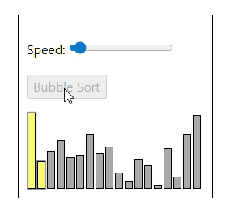

**How it works:**
- Go through the array, one value at a time.
- For each value, compare the value with the next value.
- If the value is higher than the next one, swap the values so that the highest value comes last.
- Go through the array as many times as there are values in the array.

**Implementation:**

```js
function bubbleSort(arr) {
    for (let i = 0; i < arr.length - 1; i++) {
        for (let j = 0; j < arr.length - 1 - i; j++) {
            if (arr[j] > arr[j + 1]) {
                let temp = arr[j]
                arr[j] = arr[j + 1]
                arr[j + 1] = temp
            }
        }
    }
    console.log(arr)
}

bubbleSort([7, 12, 9, 11, 3]) // [ 3, 7, 9, 11, 12 ]
```

- Time complexity: O(n^2)
- Space complexity: O(1)
 
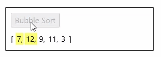


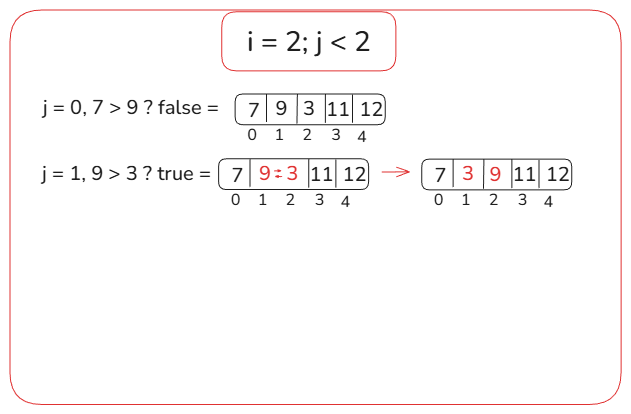
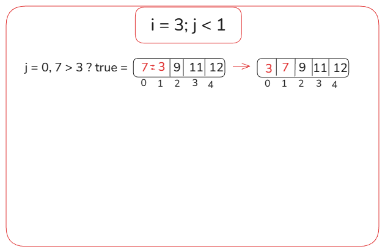


**Note:** The Bubble Sort algorithm can be improved a little bit more. Imagine the array will be sorted after the first run, then the later operation are waste of time.

```js
function bubbleSort(arr) {
    for (let i = 0; i < arr.length - 1; i++) {
        let isSwapped = false
        for (let j = 0; j < arr.length - 1 - i; j++) {
            if (arr[j] > arr[j + 1]) {
                let temp = arr[j]
                arr[j] = arr[j + 1]
                arr[j + 1] = temp
                isSwapped = true
            }
        }
            if (!isSwapped) break
    }
    console.log(arr)
}

bubbleSort([7, 3, 9, 12, 11]) // [ 3, 7, 9, 11, 12 ]
```

### Selection Sort: 
The Selection Sort algorithm finds the lowest value in an array and moves it to the front of the array.

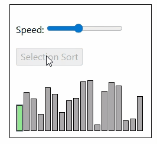

**How it works:**
- Go through the array to find the lowest value.
- Move the lowest value to the front of the unsorted part of the array.
- Go through the array again as many times as there are values in the array.

**Implementation:**

```js
function selectionSort(arr) {
    for (let i = 0; i < arr.length - 1; i++) {

        let minIdx = i

        for (let j = i + 1; j < arr.length; j++) {
            if (arr[j] < arr[minIdx]) {
                minIdx = j
            }
        }

        let temp = arr[i]
        arr[i] = arr[minIdx]
        arr[minIdx] = temp
    }

    console.log(arr)
}

selectionSort([7, 12, 9, 11, 3]) // [ 3, 7, 9, 11, 12 ]
```

- Time complexity: O(n^2)
- Space complexity: O(1)

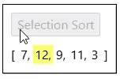

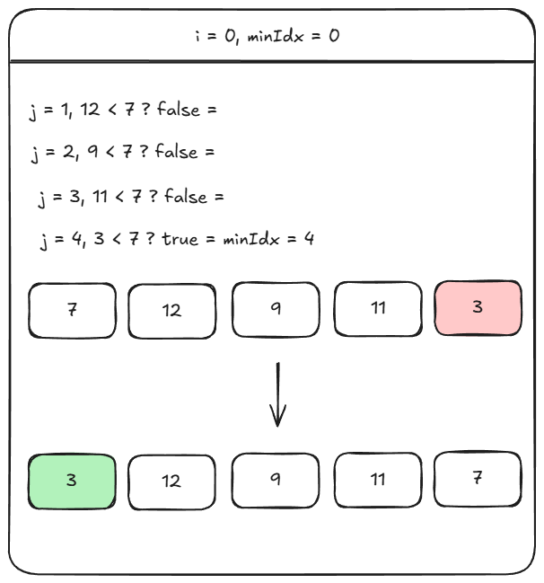
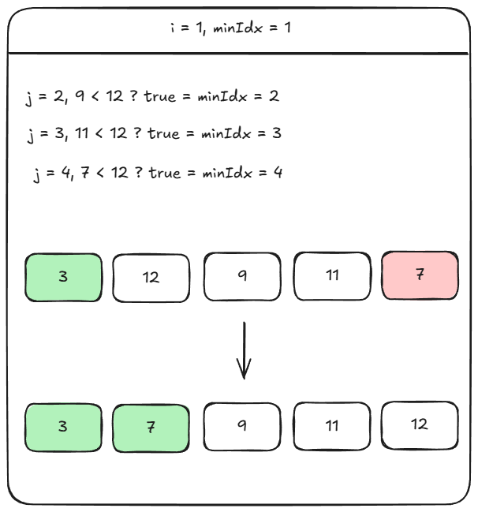
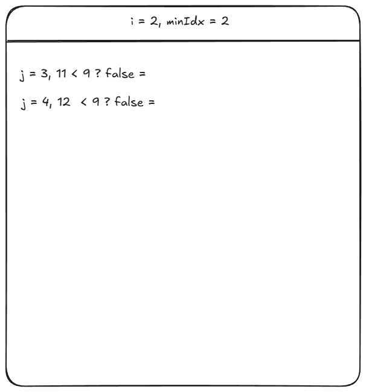
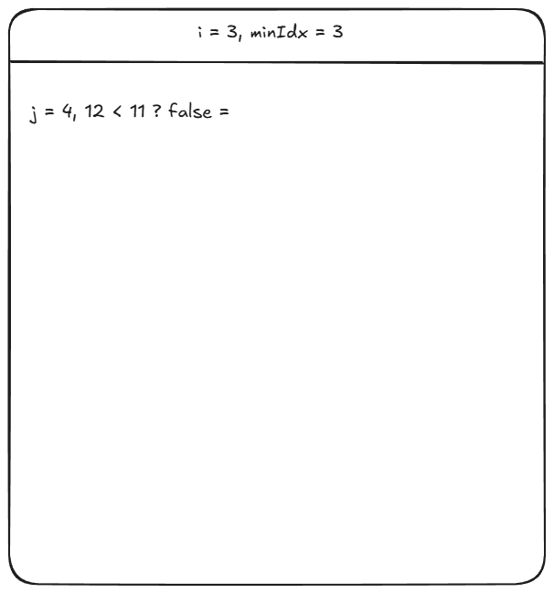

### Insertion Sort: 
The Insertion Sort algorithm uses one part of the array to hold the sorted values, and the other part of the array to hold values that are not sorted yet.

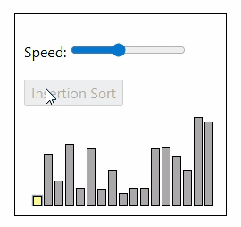

**How it works:**
- Take the first value from the unsorted part of the array.
- Move the value into the correct place in the sorted part of the array.
- Go through the unsorted part of the array again as many times as there are values.

**Implementation:**

```js
function insertionSort(arr) {
    for (let i = 1; i < arr.length; i++) {
        let key = arr[i];
        let j = i - 1

        while (j >= 0 && arr[j] > key) {
            arr[j + 1] = arr[j]
            j--
        }
        arr[j + 1] = key
    }

    console.log(arr)
}

insertionSort([7, 12, 9, 11, 3]) // [ 3, 7, 9, 11, 12 ]
```

- Time complexity: O(n^2)
- Space complexity: O(1)

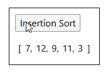

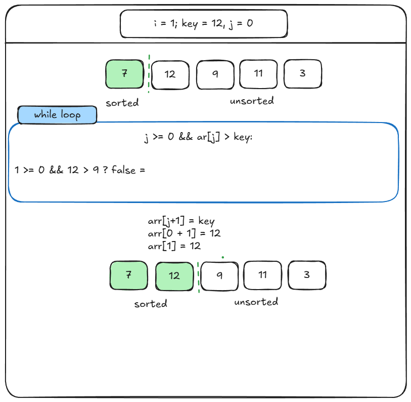
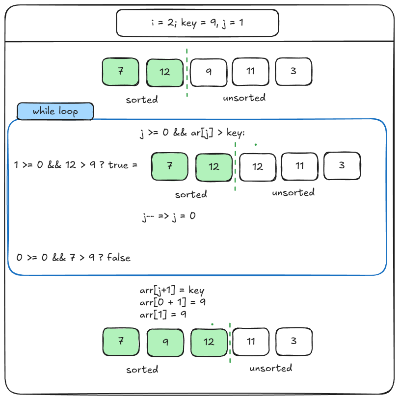
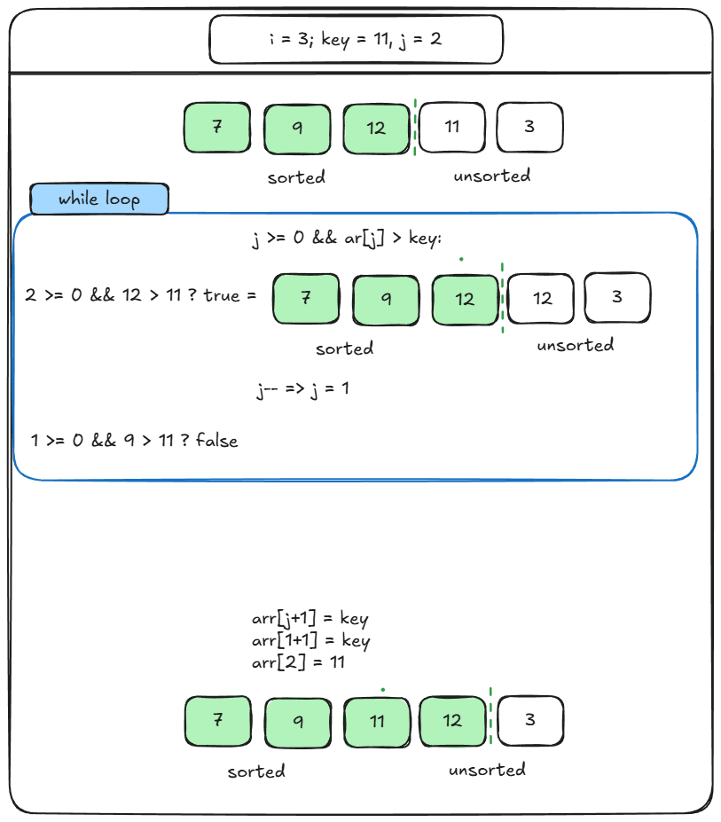
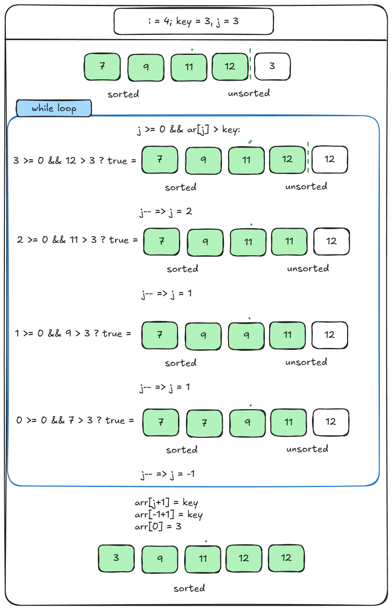


### Quick Sort:
Pick a pivot element and place it in its correct position. All smaller elements go left, larger elements go right. Repeat this process recursively.

```js
function quickSort(arr) {
    if (arr.length <= 1) {
        return arr;
    }

    let pivot = arr[arr.length - 1];
    let left = [];
    let right = [];

    for (let i = 0; i < arr.length - 1; i++) {
        if (arr[i] < pivot) {
            left.push(arr[i]);
        } else {
            right.push(arr[i]);
        }
    }

    return [...quickSort(left), pivot, ...quickSort(right)];
}

console.log(quickSort([5, 3, 8, 4, 2]));
```

#### How insertion sort works:
#### Time & Space Complexity
| Case    | Time       |
| ------- | ---------- |
| Best    | O(n log n) |
| Average | O(n log n) |
| Worst   | O(n²)      |
| Space   | O(log n)   |

Worst case happens when array is already sorted and bad pivot is chosen.

### Marge Sort: 
Split the array into halves until each part has one element, then merge them back in sorted order.

```js
function mergeSort(arr) {
    if (arr.length <= 1) {
        return arr;
    }

    const mid = Math.floor(arr.length / 2);
    const left = mergeSort(arr.slice(0, mid));
    const right = mergeSort(arr.slice(mid));

    return merge(left, right);
}

function merge(left, right) {
    let result = [];
    let i = 0, j = 0;

    while (i < left.length && j < right.length) {
        if (left[i] < right[j]) {
            result.push(left[i]);
            i++;
        } else {
            result.push(right[j]);
            j++;
        }
    }

    return result.concat(left.slice(i)).concat(right.slice(j));
}

console.log(mergeSort([5, 3, 8, 4]));
```

#### Time & Space Complexity:

| Case    | Time       |
| ------- | ---------- |
| Best    | O(n log n) |
| Average | O(n log n) |
| Worst   | O(n log n) |
| Space   | O(n)       |


## Searching:

### Binary Search:
Binary Search is an efficient algorithm to find an element in a sorted array by repeatedly dividing the search space in half.

Note: Binary Search ONLY works on sorted dat

#### How Binary Search Works:

Steps: 

- Find the middle element:  `Math.floor((left + right) / 2);`
- Compare with target, If:
  - target === mid → FOUND, else:
    - target < mid → search left half
    - target > mid → search right half
  - Repeat until found or range is empty

Visualization:

```js
Array:   [2, 4, 6, 8, 10, 12, 14] - Target: 10
Indexes:  0  1  2  3   4  5   6

mid = (0 + 6) / 2 = 3 → arr[3] = 8
10 > 8 → search right

left = 4, right = 6
mid = (4 + 6) / 2 = 5 → arr[5] = 12
10 < 12 → search left

left = 4, right = 4
mid = 4 → arr[4] = 10 → FOUND 🎯
```

```js
function binarySearch(arr, target) {
    let left = 0;
    let right = arr.length - 1;

    while (left <= right) {
        let mid = Math.floor((left + right) / 2);

        if (arr[mid] === target) {
            return mid;
        }
        else if (target < arr[mid]) {
            right = mid - 1;
        }
        else {
            left = mid + 1;
        }
    }

    return -1; // not found
}

const nums = [2, 4, 6, 8, 10, 12, 14];
console.log(binarySearch(nums, 10)); // 4
console.log(binarySearch(nums, 7));  // -1
```